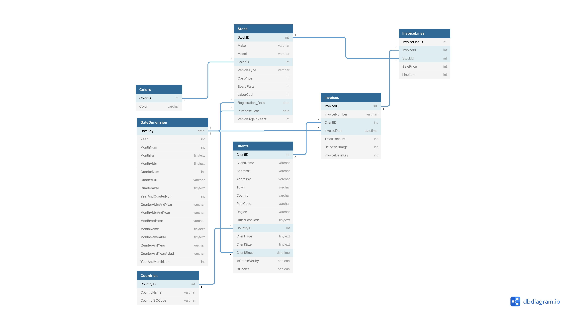

# Data Analysis with Python

No exclusive GNU utilities usage.

Solution developed on **Windows**.

## How to use ? :smiley:

To run this program, do one of the following :arrow_down:

#### If you plan to use automatic execution...

This option will need you to be able to execute makefile commands.

For more information about how to install **MAKE GNU** into your computer, direct to: [Makefile Documentation](docs/Makefile.md)

### First-Use Instructions

First steps to use this project into your computer.

#### Manual Execution

```bash
#Do the data transformations
python app/main.py
#Execute the Jupyter notebooks at the 'notebooks folder'
jupyter nbconvert --to notebook --execute notebooks/reports.ipynb --output output/reports.ipynb
```

#### Automatic Execution

```bash
make example-excercise
```

## Documentation Overview :arrow_down:

Quick overview over some of the functionalities of this project.

Consult the documentation folder for more information: [Documentation](docs/)

### Data Diagram

Dataset to use during this exercise.



For more information about the data used, please refer to: [Excel File](app/data/CarSalesDataForReports.xlsx)

**Note**
You will not be able to open it on Github... :sweat_smile:

### Data Transformations

The data transformations will be carried out with help of Python scripts, which will use the modules `pandas` and `sqlite3`.

For more information about the data used, please refer to: [Scripts Python Module](app/scripts/)

### Author

Miguel Estrada: [miguelestradam36@gmail.com](mailto:miguelestradam36@gmail.com)