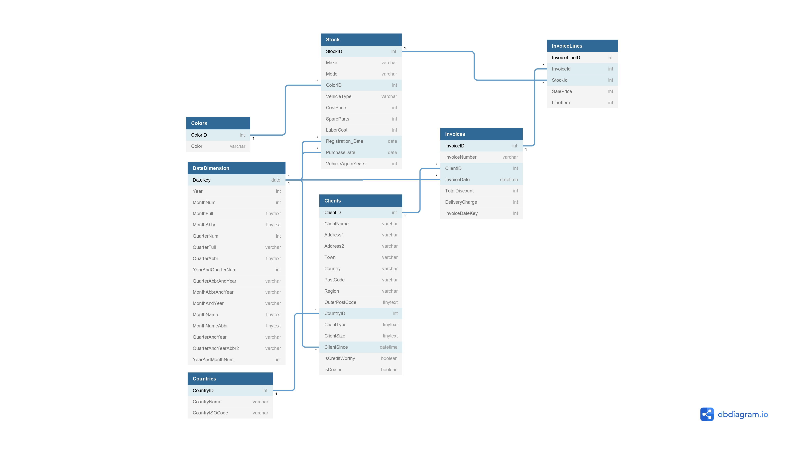

### Data Diagram

Dataset to use during this exercise.

For more information about the data used, please refer to: [Excel File](app/data/CarSalesDataForReports.xlsx)

**Note**
You will not be able to open it on Github... :sweat_smile:

### Data Transformations

The data transformations will be carried out with help of Python scripts, which will use the modules `pandas` and `sqlite3`.

For more information about the data used, please refer to: [Scripts Python Module](app/scripts/)

### Create context with SQL

In this excercise due to time matters, the Database was not created solely with SQL.

But one good approach of doing so, could be found at: [SQL Example](examples/create_context.sql)